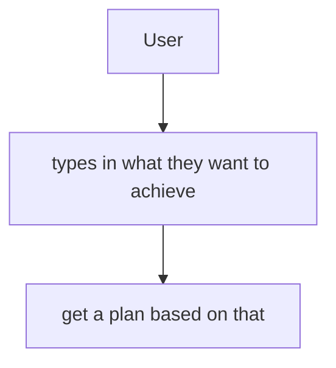

## Overview

This app allows users to generate a day/task plan based on AI using established productivity techinques.

## User Journey



## Application Architecture
Designing the algorithm for our code, problem

### Use-case 1:
```mermaid
A[accept a prompt] --> B[Usethe prompt]